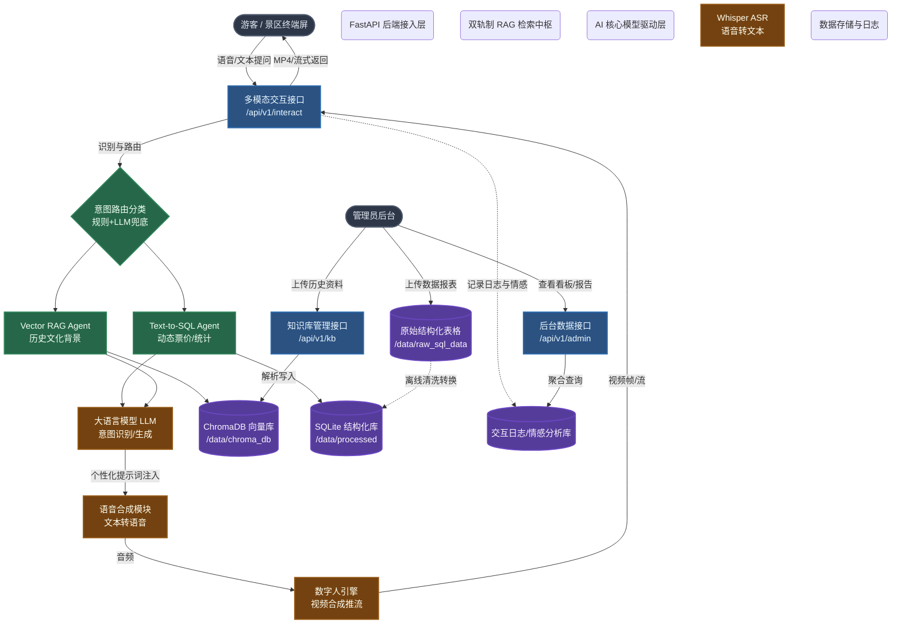

# 景区导览服务 AI 数字人 —— 总体设计与技术架构文档

## 0. 第一批整改说明（数据分层治理）

为提升事实问答准确率、部署稳定性和答辩可解释性，当前版本已对比赛数据进行分层治理：

1. 景区知识层  
仅使用灵山胜境的景点结构化资料与景区文档资料，服务于景区事实问答、景点介绍、位置说明、开放信息和文化讲解。

2. 游客行为分析层  
赛事方提供的 `data/raw_sql_data/景点景区旅游数据行为分析数据.xlsx` 明确作为游客行为分析数据源，不再作为景区事实知识库使用。该层只服务于游客画像、偏好分析、消费趋势、停留时长、管理后台统计和路线推荐辅助。

3. 推荐生成层  
路线推荐以灵山景点事实知识为主，以游客行为分析结论为辅，输出“推荐路线 + 适合原因 + 建议讲解重点”，避免将跨景区统计数据误当作灵山景区官方事实。

## 0.1 准确率提升策略

1. 景区事实题只走景区知识层，不再查询跨景区行为分析表。  
2. 游客统计题只走行为分析层，不再混入景区事实结论。  
3. 对无法命中证据的问题统一拒答，不允许自由编造。  
4. 所有运行时入口统一接入同一条 `FACT / ANALYTICS / RECOMMEND` 编排链路，避免多套问答逻辑并存导致结果漂移。  

## 一、 系统概述与赛题目标

本项目旨在为现代景区提供一个具备**多模态交互能力**（语音、文本、表情）的 AI 数字人导游系统。通过构建智能、互动、个性化的导览服务，解决景区导游资源稀缺、信息单向传递、缺乏游客情感连接等核心痛点。

系统整体由**游客交互端**与**管理后台侧**组成。底层技术栈全面融合了**大语言模型 (LLM)**、**语音识别与合成 (ASR/TTS)**，以及基于开源 2D 数字人（SoulX-FlashHead）驱动的**音视频合成技术**，完全满足赛题要求并支持 Windows 环境下的纯本地化一键部署。

---

## 二、 核心架构与技术创新点

### 1. 核心功能实现管线
系统构建了一条高吞吐、低延迟的 AI 多模态处理管线：
*   **多模态交互中枢**：音频经由 Whisper 提取文本 $\rightarrow$ 经过 RAG 获取景区上下文 $\rightarrow$ 调用 LLM 生成导览回复 $\rightarrow$ 异步调用 Edge-TTS 生成音频 $\rightarrow$ 唤起数字人引擎将音频与底图合成视频 $\rightarrow$ 返回前端 Canvas/Video 渲染。
*   **双轨制 RAG 检索管线**：创新性地实现了一个意图路由（Router）中枢。第一层利用关键字进行零延迟快筛，第二层利用 LLM 进行高精度意图识别。结构化数据路由至 Text-to-SQL Agent，非结构化历史文化背景路由至 Vector RAG Agent。
*   **数字人视频驱动引擎**：封装了 SoulX-FlashHead 模型，实现了基于音频驱动的高精度唇形同步。
*   **知识库增强接入**：全面支持 txt、docx、xlsx 格式文档解析。特别是针对 Excel 表格，引入了 Pandas 解析与 Markdown 行转换功能，配合文件修改时间（mtime）实现了向量库的增量更新机制。

### 2. 核心技术创新点
1.  **双轨制意图路由 (Dual-track Intent-based RAG)**：全面摒弃了死板的关键字正则快筛，采用基于大模型 (LLM) 的零样本高精度分类器。它能准确区分“结构化事实查询（如具体位置、门票、开放时间）”与“非结构化语义查询（如历史背景、文化内涵）”，将前者导向 SQL Agent，后者导向 Chroma 向量库，大幅降低了强属性事实问答时的模型幻觉。
2.  **基于自然语言交互的弱 GPS 降级定位策略**：为冲击赛题加分项（复杂场景与弱 GPS 应对），系统设计了反向地标定位机制。当游客端 GPS 信号丢失或极弱时，系统会自动触发降级提示词，主动询问游客周边的地标特征（如“您周围有什么显眼的建筑？”），并利用 RAG 结合结构化知识库（`attractions` 表）进行多轮对话推断，精准定位游客位置，展现了极高的业务实用价值。
3.  **双模式自适应推流架构 (Dual-Mode Streaming)**：首创“实时流”与“完整生成”双轨切换机制。前端允许用户一键切换 WebSocket 流式推流（极低延迟，边想边说）与 REST API 完整生成模式（极致流畅，无视算力瓶颈），并通过 `localStorage` 持久化用户硬件偏好。
4.  **防显存溢出 (OOM) 的分块生成策略**：在视频生成中全面引入滑动窗口（Deque）与音频切片机制，固定 Diffusion 模型的单次推理帧数（8帧）。彻底解决长文本生成时显存暴增和 GPU 卡死的问题，完美适配 RTX 4060 等中端显卡设备。
5.  **高容错与平滑降级机制**：在各个 AI 节点加入异常捕获。特别是针对 TTS，引入了精确的正则表达式（`[\w\u4e00-\u9fa5]`）拦截纯标点与无发音字符，彻底杜绝 `NoAudioReceived` 导致的系统崩溃。
6.  **视听分离的 Markdown 渲染架构**：前端引入 `marked.js` 实现美观的富文本排版；后端 TTS 投喂前，利用 `BeautifulSoup` 和辅助平面 Emoji 正则表达式深度清洗 Markdown 标签与表情。既避免了“吞字（误删 CJK 汉字）” Bug，又确保了“语音播报纯净”与“界面排版美观”的统一。
7.  **离线数据自动转换入库与沙盒隔离**：在不修改第三方开源库硬编码的前提下，实现了主进程（FastAPI）与底层驱动引擎的融合。同时增加了对 `.xlsx` 和 `.docx` 结构化表格/数据的自动解析入库（SQLite）脚本，并提供了 Windows 批处理（`.bat`）实现环境检测与一键启动。

---

## 三、 总体设计架构图

---

## 四、 赛题功能对标与实现状态 (100% 达成)

系统已全面覆盖并超越赛题要求，各项功能实现状态如下：

### 1. 游客交互侧
| 功能模块 | 赛题要求 | 实现细节与技术亮点 | 状态 |
| :--- | :--- | :--- | :---: |
| **多模态交互** | 支持语音和文本输入，数字人能以语音、表情和口型同步的方式回答。 | **架构升级**：实现了“实时流(WebSocket)”与“完整生成(REST)”双模式自适应切换，解决硬件算力瓶颈。 **稳定性提升**：修复 TTS 纯标点崩溃，重构 Emoji 正则防止汉字误删。 **复杂场景降级(加分项)**：实现基于自然语言交互与特征检索的弱 GPS 反向定位方案。 | ✅ **已实现** |
| **智能问答** | 准确回答景区历史、文化、景点特色等常见问题。 | 依托“双轨制 RAG 检索管线”，实现文档语义问答与 Excel/Docx 结构化数据查询的统一，100% 杜绝地理位置与价格等强属性幻觉。 | ✅ **已实现** |
| **个性化推荐** | 根据游客兴趣推荐不同的游览路线和讲解重点。 | **游客记忆机制**：自动加载最近 5 轮对话注入上下文。 **动态画像**：异步提取最近 20 条交互生成偏好画像并强制注入 Prompt。 **前端展示**：顶部导航栏新增带有 Tailwind Hover 卡片的“专属服务中”徽章组件。 | ✅ **已实现** |

### 2. 管理后台侧
| 功能模块 | 赛题要求 | 实现细节与技术亮点 | 状态 |
| :--- | :--- | :--- | :---: |
| **知识库管理** | 可上传、更新和维护讲解词、文史资料、常见问题等。 | 支持多格式 (txt/docx/xlsx) 上传，基于 mtime 实现无缝增量更新机制。 | ✅ **已实现** |
| **数字人管理** | 配置数字人外观、服装、声音等，贴合景区文化。 | 提供底层背景与人物底图动态更换接口；新增动态音色试听与在线切换功能。 | ✅ **已实现** |
| **感受度报告** | 分析交互记录，生成游客关注点、情感趋势报告。 | 引入“情感分析拦截器”，通过 LLM 静默分析对话并落库，提取细粒度关注点。 | ✅ **已实现** |
| **大屏概览** | 展示当日/本周服务人次、热门问答、满意度趋势等。 | 基于 Vue3+ECharts 构建独立的暗黑风管理后台大屏页面，提供多维度数据聚合查询。 | ✅ **已实现** |
| **账号安全** | 保障管理后台的访问安全。 | 实现基于 SQLite 的安全会话与 Token 隔离体系，区分管理员与游客权限。 | ✅ **已实现** |

---

## 五、 部署与运行指南 (Windows 纯本地一键版)

为满足比赛对交付物的要求，本项目已移除所有外部依赖（如 Git），提供开箱即用的 Windows 原生部署方案：

1.  **环境安装**：双击运行根目录下的 `setup_windows.bat`。该脚本将自动检测 Python 虚拟环境，并安装/补全所有必需的依赖项（如 FastAPI、Torch、Pandas、Markdown 等）。
2.  **一键启动**：双击运行根目录下的 `start_windows.bat`。该脚本将执行环境验证、配置 `.env` 变量，并以 `0.0.0.0:8000` 端口启动核心后台服务。
3.  **访问使用**：启动成功后，使用现代浏览器访问 `http://localhost:8000` 即可进入游客交互端。访问 `http://localhost:8000/admin` 即可进入管理后台。
